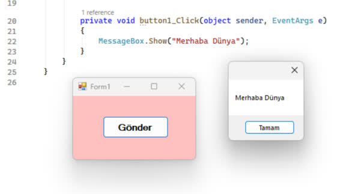

## 📋 About

**TR - TÜRKÇE**

Bu uygulamaların hepsini 10. sınıfta, ders kitabına bakarak yazılıma ilk başladığım zamanlarda okulda yapmıştım. O zamana kadar hayatımda neredeyse klavyeye bile dokunmamıştım. Üzerinden yaklaşık 4 yıl geçmiş. Bir anı ve arşiv olarak burada kalsın istedim.

##

**EN - ENGLISH**

I built all of these back in 10th grade at school, when I first started coding by following a textbook. I had barely even used a keyboard before that. It’s been almost 4 years now. Keeping this here as a memory and an archive.

##

